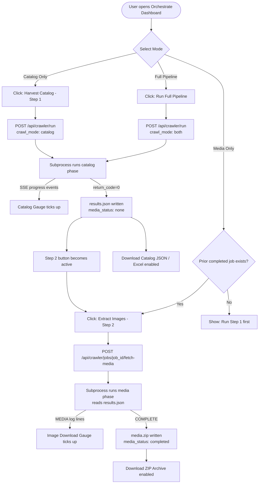

# Introduction

This specification defines the architectural design, CLI interface changes, FastAPI data contracts, SQLite schema migrations, and UI interaction patterns required to decouple **Step 1: Product Catalog Harvesting** from **Step 2: Media Asset Downloading** in the Pharmacy Normalizer scraper system (`shefaa-crawler/main.py`).

Currently, the `--download` flag causes binary image fetching to run **inline and synchronously** after catalog text extraction in the same subprocess. This conflation causes severe rate limiting (HTTP 429), inflated campaign run times, and loss of full catalog data on any mid-download network interruption. This specification defines a clean, two-phase architecture to resolve these issues.

---

## 1. Purpose & Scope

### 1.1 Problem Statement

The existing flow for a product scrape with media is:

```
[Spawn subprocess]
  → Parse category pages  (HTML fetching)
  → Extract product metadata  (fast, text-only)
  → For each product, call download_image()  ← BLOCKS thread, triggers 429
  → Write results.json
  → Zip media/ folder
[Subprocess exits]
```

This design has three critical failure modes:

1. **Severe HTTP 429 Rate Limiting**: `download_image()` is called from inside the same `ThreadPoolExecutor` workers that are already hammering `chefaa.com` for HTML pages. The combined request rate triggers CDN rate limits rapidly, stalling all workers.
2. **Thread Blocking**: Image downloads are synchronous and blocking within product-fetching threads, starving the thread pool and reducing effective concurrency for catalog scraping.
3. **Data Loss on Interruption**: If the subprocess is killed (manual stop, timeout, or 429 exhaustion) mid-download, all un-downloaded images are lost and the `results.json` file may be partially written or locked.

### 1.2 Proposed Solution

Introduce a `--crawl-mode` CLI flag to the crawler with three values:

| Mode | Behavior |
|---|---|
| `catalog` | Parse HTML, extract text metadata & remote image URLs. Write `results.json`. Do **NOT** download images. |
| `media` | Read an existing `results.json`. Download and compress images into `media.zip`. Emit download progress to stdout. |
| `both` | Run `catalog` phase to completion, then immediately run `media` phase sequentially. |

The UI exposes two explicit launch buttons that trigger these modes independently, with separate telemetry gauges.

### 1.3 Scope

This specification covers changes to:
- `shefaa-crawler/main.py` — CLI entrypoint and execution engine
- `backend/tools/api.py` — FastAPI endpoints: `CrawlRunRequest`, `compile_cli_args`, `run_crawler_subprocess`
- `backend/tools/crawler_db.py` — SQLite schema additions for media progress tracking
- `frontend/app/dashboard/crawler/page.tsx` — Dual-step Orchestration UI
- `frontend/app/dashboard/crawler/crawler-context.tsx` — State types and API payloads

### 1.4 Out of Scope

- Changes to Meilisearch indexing logic
- Changes to the brand or category scraping pipelines (only `--products` pipeline is affected)
- Multi-server or distributed job execution

---

## 2. Definitions

| Term | Definition |
|---|---|
| **Catalog Phase** | The process of fetching HTML product listing pages, extracting text metadata (name, price, brand, category, slug, `featured_image` URL), and writing the output to `results.json`. Binary image files are NOT downloaded. |
| **Media Phase** | The process of reading `featured_image` URLs from an existing `results.json`, downloading the binary image files to `data/media/products/`, and compressing them into `media.zip`. |
| **`results.json`** | The canonical output file of the Catalog Phase. Lives at `backend/data/crawler/jobs/{job_id}/results.json`. |
| **`media.zip`** | The canonical output of the Media Phase. Lives at `backend/data/crawler/jobs/{job_id}/media.zip`. |
| **HTTP 429** | "Too Many Requests" — CDN rate-limit response triggering exponential backoff. |
| **SSE** | Server-Sent Events — the unidirectional streaming protocol used by `/api/crawler/jobs/{job_id}/stream` to push real-time telemetry to the frontend. |
| **`job_id`** | A UUID uniquely identifying a single crawl campaign record in the `crawler_jobs` SQLite table. |
| **`--crawl-mode`** | The new CLI argument added to `main.py`. Replaces the current dual-purpose `--download` flag for media control. |

---

## 3. Requirements, Constraints & Guidelines

### 3.1 Functional Requirements

- **REQ-001**: `main.py` must accept a new CLI argument `--crawl-mode` with choices `catalog`, `media`, and `both`. Default value: `catalog`.
- **REQ-002**: When `--crawl-mode catalog` is active, the script must **never** call `download_image()` regardless of any other flags. The `--download` flag must be deprecated and ignored when `--crawl-mode` is explicitly set.
- **REQ-003**: When `--crawl-mode media` is active, the script must accept a `--source` argument pointing to an existing `results.json` file path. It must iterate all products in that file, download `featured_image` URLs, and emit structured progress logs parseable by `run_crawler_subprocess`.
- **REQ-004**: When `--crawl-mode both` is active, the script executes the `catalog` phase first to completion, then immediately executes the `media` phase using the freshly written `results.json`. Both phases must be logged with distinct phase markers.
- **REQ-005**: The `CrawlRunRequest` Pydantic model in `api.py` must be extended with a `crawl_mode: str = "catalog"` field.
- **REQ-006**: `compile_cli_args()` in `api.py` must inject `--crawl-mode {req.crawl_mode}` into the CLI command, and inject `--source {output_path}` when `crawl_mode == "media"`.
- **REQ-007**: The FastAPI `POST /api/crawler/run` endpoint must accept and pass through the `crawl_mode` field.
- **REQ-008**: A new FastAPI endpoint `POST /api/crawler/jobs/{job_id}/fetch-media` must exist to launch a standalone `media` phase subprocess for any existing completed `catalog` job.
- **REQ-009**: The SQLite `crawler_jobs` table must track `images_total`, `images_completed`, and `media_status` (values: `none`, `running`, `completed`, `failed`) as separate columns from the catalog progress fields.
- **REQ-010**: The frontend Orchestration dashboard must display two independent launch buttons: **"Harvest Catalog (Step 1)"** and **"Extract Images (Step 2)"**.
- **REQ-011**: The Step 2 button must be disabled (grayed out) unless the selected campaign's `status` is `completed` AND `media_status` is `none` or `failed`.
- **REQ-012**: Media phase progress (images downloaded, total images, percentage) must be emitted as SSE `progress` events and rendered in a dedicated "Image Download" gauge in the Orchestration telemetry grid.

### 3.2 System Constraints

- **CON-001**: The catalog subprocess and the media subprocess must never run concurrently for the same `job_id`. The API must enforce this by checking `media_status` before launching Step 2.
- **CON-002**: The `--crawl-mode media` subprocess reads `results.json` but must **never modify or overwrite** it.
- **CON-003**: SQLite writes from the two phases (catalog progress updates vs. media progress updates) must use separate column sets to avoid contention. No shared mutable columns between the two phases.
- **CON-004**: Temporary raw image files in `data/media/products/` must be cleaned up from disk after the `media.zip` is successfully written and verified. If ZIP creation fails, raw files must be preserved for retry.
- **CON-005**: The existing `--download` flag behavior must remain functional for backward compatibility when `--crawl-mode` is **not** explicitly provided, to avoid breaking any existing CLI scripts or cron jobs.

### 3.3 Guidelines

- **GUD-001**: The media phase subprocess should use a dedicated `ThreadPoolExecutor` with a default of **2 workers** (lower than catalog's default of 4), as image download is bandwidth-heavy and more likely to trigger CDN throttling.
- **GUD-002**: Media phase workers must implement the same exponential backoff retry logic already present in `download_image()`: up to 3 attempts with base delay of 1.5s, capped at 429 and URLError scenarios.
- **GUD-003**: Progress logs emitted by the media phase subprocess must include a distinguishable prefix (e.g., `[MEDIA]`) so the `read_stream` parser in `run_crawler_subprocess` can differentiate them from catalog-phase logs and update the correct `images_completed` counter.

---

## 4. Interfaces & Data Contracts

### 4.1 CLI Interface — `main.py` Argument Changes

#### New Argument: `--crawl-mode`
```
--crawl-mode {catalog,media,both}
    Control which pipeline phase to execute.
    catalog : Extract text metadata and image URLs. No binary downloads. (default)
    media   : Download images from an existing results.json. Requires --source.
    both    : Run catalog then media phases sequentially.
```

#### New Argument: `--source`
```
--source <path>
    Path to an existing results.json file.
    Required when --crawl-mode is 'media'.
    Ignored in 'catalog' and 'both' modes.
```

#### Deprecated Behavior Change
The existing `--download` flag continues to work **only** when `--crawl-mode` is not explicitly set (backward-compatibility bridge). When `--crawl-mode` is present, `--download` is silently ignored.

#### Media Phase Progress Log Format
The media subprocess must emit structured lines to stdout parseable by `read_stream`:
```
[MEDIA] 1/29800 Downloaded: panadol-extra-500mg.png
[MEDIA] 2/29800 Downloaded: brufen-400mg.png
[MEDIA] 150/29800 HTTP 429 - retrying in 3.2s for voltaren-gel.png
[MEDIA] COMPLETE: 29745/29800 images downloaded. 55 failed. ZIP written to media.zip
```

---

### 4.2 FastAPI — `CrawlRunRequest` Schema

**File**: `backend/tools/api.py`

```python
class CrawlRunRequest(BaseModel):
    target: str                          # products, categories, sub-categories, brands
    category_href: Optional[str] = "all"
    localize: Optional[bool] = False
    country: Optional[str] = "eg"
    lang: Optional[str] = "en"
    deep: Optional[bool] = False
    download: Optional[bool] = False     # Deprecated: use crawl_mode instead
    include_media: Optional[bool] = False
    stats_only: Optional[bool] = False
    pages: Optional[str] = "1"
    background: Optional[bool] = True
    workers: Optional[int] = 4
    crawl_mode: Optional[str] = "catalog"  # NEW: "catalog" | "media" | "both"
```

---

### 4.3 FastAPI — New Endpoint: Fetch Media for Existing Job

**Endpoint**: `POST /api/crawler/jobs/{job_id}/fetch-media`

**Purpose**: Launch a standalone media-phase subprocess for a job whose catalog phase is already completed.

**Request**: No body required. Job ID from path parameter.

**Response**:
```json
{
  "job_id": "abc-123",
  "status": "media_running",
  "message": "Media extraction subprocess launched."
}
```

**Error responses**:
- `404` — Job not found
- `409` — `media_status` is already `running` or `completed`
- `422` — Job `status` is not `completed` (catalog not finished)

---

### 4.4 SQLite Schema — `crawler_jobs` Table Additions

**File**: `backend/tools/crawler_db.py` — `init_db()` migration block

```sql
-- Tracks the crawl mode used when the job was launched
ALTER TABLE crawler_jobs ADD COLUMN crawl_mode TEXT DEFAULT 'catalog';

-- Media phase tracking (independent from catalog progress columns)
ALTER TABLE crawler_jobs ADD COLUMN images_total INTEGER DEFAULT 0;
ALTER TABLE crawler_jobs ADD COLUMN images_completed INTEGER DEFAULT 0;
ALTER TABLE crawler_jobs ADD COLUMN media_status TEXT DEFAULT 'none';
-- media_status values: 'none' | 'running' | 'completed' | 'failed'
```

**New helper functions** to add to `crawler_db.py`:

```python
def start_media_phase(job_id: str, images_total: int) -> None:
    """Mark media extraction as started for a job."""

def update_media_progress(job_id: str, images_completed: int) -> None:
    """Increment the images_completed counter."""

def finalize_media_phase(job_id: str, status: str, media_zip: Optional[str]) -> None:
    """Set media_status to 'completed' or 'failed' and record media_zip path."""
```

---

### 4.5 SSE Telemetry — Extended Progress Event Payload

The `progress` SSE event emitted by the `read_stream` parser must be extended to include media phase fields:

```json
{
  "job_id": "abc-123",
  "status": "running",
  "crawl_mode": "both",
  "progress": {
    "total_categories": 48,
    "processed_categories": 48,
    "products_found": 29800,
    "current_action": "Catalog complete. Starting media extraction...",

    "images_total": 29800,
    "images_completed": 4532,
    "media_status": "running"
  }
}
```

---

### 4.6 Frontend — TypeScript Type Extensions

**File**: `frontend/app/dashboard/crawler/crawler-context.tsx`

```typescript
interface Job {
  // ... existing fields ...
  crawl_mode?: "catalog" | "media" | "both";

  // Media phase fields
  images_total?: number | null;
  images_completed?: number | null;
  media_status?: "none" | "running" | "completed" | "failed" | null;
}
```

---

## 5. Acceptance Criteria

- **AC-001**: Given a `POST /api/crawler/run` with `{ "target": "products", "crawl_mode": "catalog" }`, when the subprocess completes, then `results.json` must exist, the `media_zip` column must be `NULL`, and `media_status` must be `"none"`.
- **AC-002**: Given a job with `status = "completed"` and `media_status = "none"`, when the user clicks "Extract Images (Step 2)" in the UI, then `POST /api/crawler/jobs/{job_id}/fetch-media` is called, a new subprocess starts, and `media_status` transitions to `"running"`.
- **AC-003**: Given the media subprocess is running, when the telemetry stream is open, then the `images_completed` counter in the Orchestration dashboard must increment in real time.
- **AC-004**: Given `--crawl-mode catalog` is active in the subprocess, when `download_image()` is encountered anywhere in the execution path, then it must NOT be called, and no file must be written to `data/media/`.
- **AC-005**: Given a media phase subprocess that encounters a `404` on an image URL, when the error occurs, then the subprocess must log the failure, skip to the next image, and continue without exiting.
- **AC-006**: Given a completed media phase, when the `media.zip` archive is verified as non-empty, then all raw image files in `data/media/products/` must be deleted and disk space must be reclaimed.
- **AC-007**: The "Extract Images (Step 2)" button in the UI must be visibly disabled when `media_status` is `"running"` or `"completed"`, with a descriptive tooltip explaining why.
- **AC-008**: Given `--crawl-mode both`, when the catalog phase exits with return code 0, then the media phase must start automatically without requiring user intervention.

---

## 6. UI / UX Interaction Flow

### 6.1 Step Progression Diagram



### 6.2 Orchestration Dashboard Control Layout

The Orchestration control section must present two distinct action areas:

#### Step 1 Panel — Catalog Harvest
- **Button**: `▶ Harvest Catalog` (green)
- **Subtitle**: "Scrape text metadata, prices, and categories. Saves `results.json`."
- **Disabled when**: A catalog or media job is currently running.

#### Step 2 Panel — Image Extraction
- **Button**: `🖼 Extract Images` (indigo/violet)
- **Subtitle**: "Download product images from a completed catalog. Produces `media.zip`."
- **Disabled when**:
  - No completed catalog job exists for the current campaign, OR
  - `media_status` is already `running` or `completed`.
- **Tooltip on disabled**: `"Complete a catalog harvest first"` or `"Images already extracted"`.

### 6.3 Telemetry Grid — 5-Column Layout (when media phase is active)

| Card 1 | Card 2 | Card 3 | Card 4 | Card 5 |
|---|---|---|---|---|
| Catalog Scrape Progress (products / categories count + bar) | Image Download Progress (images_completed / images_total + bar) | Execution Timer (count-up clock) | Status & Current Action | Kill Controls |

When only the catalog phase is active (no media phase), the grid collapses to 4 columns (Image Download card is hidden).

---

## 7. Rationale & Context

### 7.1 Why Separate Processes, Not Just Separate Functions?

Since `run_crawler_subprocess` manages a single external `asyncio` subprocess, keeping catalog and media as separate subprocess invocations gives several benefits:
1. **Independent kill control**: Users can stop the media download without affecting the saved `results.json`.
2. **Separate PID tracking**: Each phase gets its own `pid` recorded in SQLite, enabling precise OS-level termination.
3. **Independent log streams**: The SSE parser can apply different regex rules per phase without state machine complexity.

### 7.2 Why 2 Default Workers for Media Phase?

Image CDNs (Cloudflare, Fastly) apply per-IP rate limits that are much tighter for binary asset traffic than for HTML pages. Setting the media worker count to 2 (vs. 4 for catalog) reduces the concurrent request burst to the CDN while still achieving reasonable throughput (~200-400 images/minute with backoff).

### 7.3 Why Not Meilisearch for Image URL Storage?

Meilisearch documents already contain `featured_image` URLs from the catalog scrape. However, reading 29,800 records from Meilisearch during the media phase would add an unnecessary external API dependency. Reading from the local `results.json` is faster, has no rate limits, and keeps the media phase fully self-contained.

---

## 8. Dependencies & External Integrations

### External Systems
- **EXT-001**: `chefaa.com` CDN — Source of product page HTML and binary image assets. Subject to HTTP 429 rate limiting.
- **EXT-002**: SQLite (`crawler_jobs.db`) — Stores per-job state including new `images_total`, `images_completed`, `media_status`, and `crawl_mode` columns.

### Technology Platform Dependencies
- **PLT-001**: Python `concurrent.futures.ThreadPoolExecutor` — Used for parallel image downloads in the media phase.
- **PLT-002**: Python `zipfile` module — Used to compile the final `media.zip` archive.
- **PLT-003**: FastAPI `asyncio.create_subprocess_exec` — Used to spawn both the catalog and media phase as separate OS processes.
- **PLT-004**: React `useEffect` + `EventSource` (SSE client) — Used by the frontend to consume real-time image download progress.

---

## 9. Examples & Edge Cases

### 9.1 Example: CLI Invocation — Catalog Only
```bash
python main.py --products all --localize --deep --pages all \
               --crawl-mode catalog --workers 4 \
               --output backend/data/crawler/jobs/abc123/results.json \
               --mode silent
```

### 9.2 Example: CLI Invocation — Media Only (from API)
```bash
python main.py --crawl-mode media \
               --source backend/data/crawler/jobs/abc123/results.json \
               --workers 2 \
               --mode silent
```

### 9.3 Edge Case: `results.json` Deleted Before Step 2

If `results.json` is missing when Step 2 (`--crawl-mode media`) is launched:
- The subprocess must exit immediately with a non-zero return code.
- The API must set `media_status = "failed"` and `error_msg = "Source results.json not found"`.
- The UI must display an error badge on the media status gauge.

### 9.4 Edge Case: Interrupted Media Phase

If the media subprocess is killed (user clicks Stop, or server crash) mid-download:
- Raw image files already downloaded must remain in `data/media/products/`.
- `media_status` must be set to `"failed"`.
- The user must be able to retry Step 2, which will overwrite already-downloaded files and attempt all images again from scratch.
- `results.json` must NOT be modified.

### 9.5 Edge Case: All Images Return 404

If every image URL in `results.json` returns 404:
- The subprocess must still exit with return code 0 (all items processed, none skipped due to code error).
- `media_zip` must be `NULL` (no ZIP written since no files to compress).
- `media_status` must be `"completed"` with a warning log: `"COMPLETE: 0/29800 images downloaded. All failed."`.

---

## 10. Validation Criteria

- **VAL-001**: Run `--crawl-mode catalog` on a 1-page campaign. Confirm `data/media/` directory is not created.
- **VAL-002**: Run `--crawl-mode media --source <path>` on a `results.json` with 10 known products. Confirm exactly 10 download attempts are made.
- **VAL-003**: Simulate an HTTP 429 response (via mock or proxy). Confirm the backoff logger emits `[MEDIA] HTTP 429 - retrying in X.Xs` and the download eventually succeeds or fails after 3 attempts.
- **VAL-004**: Confirm `POST /api/crawler/jobs/{job_id}/fetch-media` returns `409` if called while `media_status = "running"`.
- **VAL-005**: After a successful media phase, confirm `data/media/products/` directory is empty and `media.zip` is non-zero in size.
- **VAL-006**: Confirm the frontend Step 2 button is visible but disabled after a catalog completes, and becomes clickable only after confirming `media_status = "none"`.

---

## 11. Related Specifications / Further Reading

- [spec-architecture-decoupled-media-crawling.md](./spec-architecture-decoupled-media-crawling.md) — This document (v2.0)
- [backend/tools/api.py](../backend/tools/api.py) — FastAPI orchestration layer
- [backend/tools/crawler_db.py](../backend/tools/crawler_db.py) — SQLite job management
- [shefaa-crawler/main.py](../shefaa-crawler/main.py) — Crawler execution engine
- [frontend/app/dashboard/crawler/page.tsx](../frontend/app/dashboard/crawler/page.tsx) — Orchestration UI
