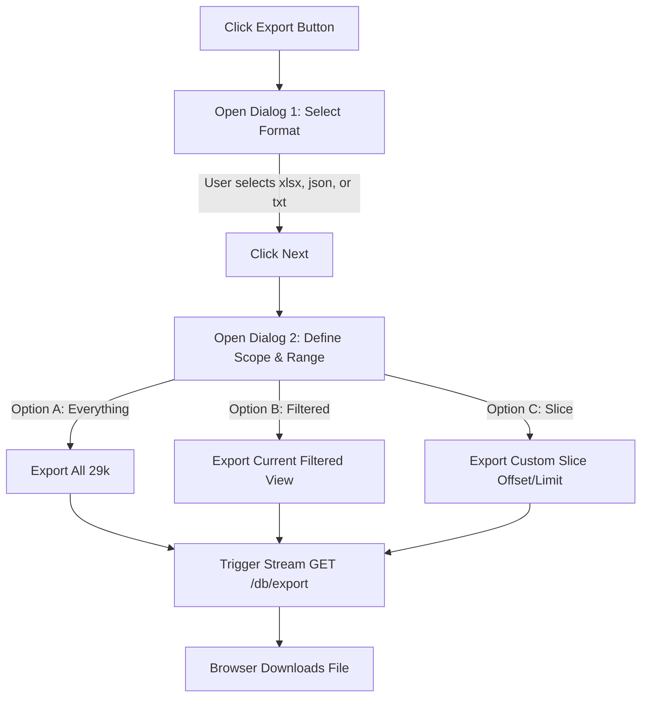

# Introduction

This specification describes the requirements and technical design for two core enhancements to the **Browse Database** (`/dashboard/browse`) user interface:
1. **Product Detail Viewer**: An interactive details panel or dialog that lets users view full attributes, metadata, and active images of any selected medication in the Chefaa catalog.
2. **Flexible Export Suite**: A two-stage export workflow that allows users to export the catalog (fully or sliced/filtered) into Excel (`.xlsx`), JSON (`.json`), or plain text (`.txt`) formats.

---

## 1. Purpose & Scope

### 1.1 Purpose
The purpose is to empower database administrators and data scientists to easily inspect individual product schemas and export portions of the 29,818 indexed pharmacy products based on filters, pagination slices, or custom parameters.

### 1.2 Scope
- **Frontend App**: `/dashboard/browse/page.tsx` UI enhancements, introduction of a detail view modal, and a two-step wizard modal for export configurations.
- **Backend API**: Introduction of a high-performance export stream endpoint `/db/export` in `backend/api.py` supporting customized format conversions, paging offsets, search queries, and column subsets.

---

## 2. Definitions

- **Browse DB**: The master database explorer view under `/dashboard/browse`.
- **Export Format**: The target file extension (Excel, JSON, TXT).
- **Export Scope**: The partition of data selected for export (e.g., entire catalog, current filtered view, custom slice).
- **Product Envelope**: The unified schema representing a single medication item, containing fields such as ID, Name (Arabic/English), SKU, Brand, Category, Price, and Image.

---

## 3. Requirements, Constraints & Guidelines

### 3.1 Product Details Viewer (FE-DET)
- **REQ-DET-001**: **Details Action Trigger**: Each product row or card in the Browse DB table must display a clear inspect icon or button labeled "View Details".
- **REQ-DET-002**: **Product Detail Modal**: Clicking the details trigger must open a responsive, clean modal containing:
  - High-resolution active thumbnail image with fallbacks.
  - Large Arabic and English name headers.
  - Core fields: **ID**, **SKU**, **Brand**, **Category**, and **Final Price** formatted in Egyptian Pounds (EGP).
  - Availability markers showing in-stock/out-of-stock statuses and stock counts.
  - Clickable external share link to redirect to the active Chefaa Web storefront.
- **REQ-DET-003**: **Aesthetics**: The modal must follow modern dark/light system styling, incorporating glassmorphism borders and clean animations via `framer-motion` for transitions.

### 3.2 Dynamic Export Workflow (FE-EXP / BE-EXP)
- **REQ-EXP-001**: **Top-Level Export Action**: A prominent "Export Catalog" action button must be added to the header area of the Browse DB dashboard, alongside global search and pagination controls.
- **REQ-EXP-002**: **Stage 1 Dialog - Format Selector**: Clicking the action must open a modal dialog prompting the user to select their desired file format:
  - **Excel Spreadsheet (`.xlsx`)**
  - **JSON Document (`.json`)**
  - **Plain Tab-Delimited Text (`.txt`)**
  - The dialog must have a disabled "Next" state until a format is selected.
- **REQ-EXP-003**: **Stage 2 Dialog - Scope Selector**: Clicking "Next" must open the configuration dialog offering options to slice, filter, and customize the output data:
  - **Export Option 1**: *Everything* - The entire catalog of 29,818 products.
  - **Export Option 2**: *Current Filtered View* - Export only the products matching the active UI search filters, brand selects, and category categories.
  - **Export Option 3**: *Custom Slice (Range)* - Let users specify a numeric range via inputs (e.g., `From index X` and `Count Y` / `To index Z`).
  - **Optional Field Selection**: A checklist allowing users to include or exclude specific attributes (e.g., exclude images to reduce text-file size).
- **REQ-EXP-004**: **Backend Export Stream (FastAPI)**: To prevent browser crashes and memory overflow when compiling 29,000+ items, the backend must expose a streaming `/db/export` endpoint. The endpoint will write rows incrementally directly to the HTTP response stream.
- **REQ-EXP-005**: **Performance Constraints**: Generation of Excel formats on the server must use streaming writer utilities (such as `pandas.ExcelWriter` with chunking) and set high-efficiency download MIME headers.

---

## 4. Interfaces & Data Contracts

### 4.1 Export API Endpoint

#### Request
- **Endpoint**: `/db/export`
- **Method**: `GET`
- **Query Parameters**:
  - `format` (string, required): `xlsx` | `json` | `txt`
  - `scope` (string, required): `all` | `filtered` | `slice`
  - `search` (string, optional): Current search filter text.
  - `offset` (integer, optional): The slice starting index (used if `scope = "slice"`). Default `0`.
  - `limit` (integer, optional): The slice volume (used if `scope = "slice"`). Default `1000`.
  - `columns` (string, optional): Comma-separated list of attributes to export (e.g., `id,name_en,price`).

#### Responses
- **200 OK (Excel Stream)**:
  - Headers:
    - `Content-Disposition: attachment; filename="chefaa_products_export.xlsx"`
    - `Content-Type: application/vnd.openxmlformats-officedocument.spreadsheetml.sheet`
- **200 OK (JSON Stream)**:
  - Headers:
    - `Content-Disposition: attachment; filename="chefaa_products_export.json"`
    - `Content-Type: application/json`
- **200 OK (TXT Stream)**:
  - Headers:
    - `Content-Disposition: attachment; filename="chefaa_products_export.txt"`
    - `Content-Type: text/tab-separated-values; charset=utf-8`

---

## 5. Acceptance Criteria

- **AC-DET-001**: Given the Browse DB page is loaded, When a user clicks the "View Details" button on product ID `63314`, Then a styled modal pops up displaying the name, SKU, price, brand, category, in-stock status, and image of Nubeqa.
- **AC-EXP-001**: Given a user has filtered the table to only show category "Medications", When they select the "Export Catalog" action and select "Current Filtered View" in Stage 2 with format "JSON", Then the downloaded JSON file contains only products belonging to the "Medications" category.
- **AC-EXP-002**: Given a user triggers a "Custom Slice" export of format "TXT" with offset `0` and limit `5000`, Then the browser immediately receives a tab-separated text file of exactly 5,000 product rows starting from the first item.
- **AC-EXP-003**: Given the user triggers "Export Everything" in format "Excel", Then the server successfully streams the 29,818 rows without timing out or exceeding standard RAM limits, and the client saves a valid `.xlsx` sheet.

---

## 6. Test Automation Strategy

### Frontend Interaction Tests
- **Component Test**: Mock a single product and assert that clicking the trigger correctly toggles modal state and renders all expected attributes.
- **Wizard Navigation**: Verify that Stage 1 transition is disabled until a format checkbox is clicked, and verify clicking "Back" in Stage 2 returns to the correct visual selection.

### API Integration & Data Delivery Tests
- **Paging Limits Assertions**: Query `/db/export?format=json&scope=slice&offset=10&limit=50` and verify the returned JSON contains exactly 50 objects matching indices 10 through 59 of the catalog database.
- **Delimiter Schema Integrity**: Assert that plain text format downloads are properly delimited by `\t` (Tab character) and contain appropriate header column strings on line 1.

---

## 7. Rationale & Context

### 7.1 UX Design Decision
By dividing the export setup into two clean dialog steps, we prevent modal clutter. The user first focuses on the simple decision of the data format (Excel, JSON, or TXT), and then specifies the data size/filters. This progressive disclosure pattern reduces cognitive overhead and increases user confidence.

### 7.2 Incremental Stream Delivery
Processing 29,800 records sequentially in a single memory block on Next.js can block client-side JavaScript execution, leading to "Page Unresponsive" errors. Pushing the heavy parsing tasks to FastAPI endpoints utilizing Python's fast generator expressions ensures sub-second response starts.

---

## 8. Dependencies & External Integrations

### Technology Platform Dependencies
- **PLT-DET-001**: Framer Motion (for modal animations)
- **PLT-EXP-001**: NextJS Client-Side File Saver (or standard HTML5 Anchor download hooks)
- **PLT-EXP-002**: Python `openpyxl` / `pandas` (for Excel serialization on backend)

---

## 9. Examples & Edge Cases

### 9.1 Stage 1 & 2 Dialog Sequence Flow Diagram (Mermaid)



### 9.2 Example Backend Route Definition
```python
from fastapi.responses import StreamingResponse
import io

@app.get("/db/export")
async def export_database(
    format: str,
    scope: str,
    search: Optional[str] = None,
    offset: int = 0,
    limit: int = 1000,
    columns: Optional[str] = None
):
    # 1. Fetch relevant dataset based on scope
    products = get_scoped_products(scope, search, offset, limit)
    
    # 2. Filter columns if requested
    if columns:
        col_list = columns.split(",")
        products = [{k: v for k, v in p.items() if k in col_list} for p in products]
        
    # 3. Stream appropriate format
    if format == "json":
        def json_generator():
            yield "["
            for idx, p in enumerate(products):
                comma = "," if idx < len(products) - 1 else ""
                yield json.dumps(p) + comma
            yield "]"
        return StreamingResponse(json_generator(), media_type="application/json")
        
    elif format == "txt":
        def txt_generator():
            headers = products[0].keys() if products else []
            yield "\t".join(headers) + "\n"
            for p in products:
                yield "\t".join(str(p.get(h, "")) for h in headers) + "\n"
        return StreamingResponse(txt_generator(), media_type="text/tab-separated-values")
        
    elif format == "xlsx":
        # Stream Excel bytes using BytesIO
        output = io.BytesIO()
        df = pd.DataFrame(products)
        with pd.ExcelWriter(output, engine='openpyxl') as writer:
            df.to_excel(writer, index=False, sheet_name="Chefaa Products")
        output.seek(0)
        return StreamingResponse(
            io.BytesIO(output.read()), 
            media_type="application/vnd.openxmlformats-officedocument.spreadsheetml.sheet"
        )
```

---

## 10. Validation Criteria

1. **Format Validation**: Verify that selecting `xlsx` exports a file that opens correctly in Microsoft Excel, and JSON exports valid, parseable JSON arrays.
2. **Details Integration**: Open details dialog for at least 5 different items across various pages, ensuring image dimensions render correctly and brand slugs are mapped (or gracefully hidden when null).
3. **Cancellation Resilience**: If an export takes longer than 5 seconds, ensure closing the dialog aborts the HTTP request cleanly.

---

## 11. Related Specifications / Further Reading

- [Next.js Modals and Route Interceptors](https://nextjs.org/docs/app/building-your-application/routing/parallel-routes)
- [FastAPI Streaming Responses Guide](https://fastapi.tiangolo.com/advanced/custom-response/#streamingresponse)
- [Pandas Excel Writing Documentation](https://pandas.pydata.org/pandas-docs/stable/reference/api/pandas.DataFrame.to_excel.html)
